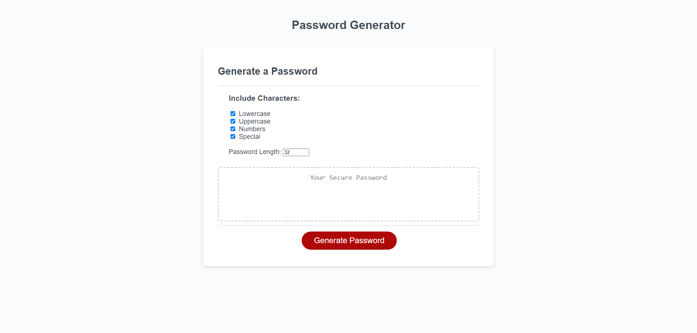

# random_password_generator

## Description
In this project I refactored code that was given to me. The purpose of the project is to refactor the the code given to generate a random password based on a set of criterion. I updated the form to include inputs for password length, lowercase characters, uppercase characters, special characters and numbers. I also wrote javascript functions to take those inputs and create a random password based off of those inputs when the user presses the "Generate Password" button. 

## Repository

Link to deployed code: [https://cjswayne.github.io/random_password_generator/](https://cjswayne.github.io/random_password_generator/)

## Technologies
- The code provided was written with HTML5, CSS and Javascript
- The random password generation logic utilizes the fisherYatesShuffle formula, which makes an unbiased randomized string

## Mockup

## Credits 
I used resources provided by the Rutgers University Bootcamp Course.

## Licensed 
This is under the MIT license.